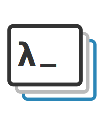

<p align="center">
  
</p>

<h1 align="center">Eigendeck</h1>

<p align="center"><em>The characteristic presentation tool.</em></p>

<p align="center">
  A desktop presentation tool with embedded interactive demos and LaTeX math.<br>
  Built for academics and researchers who give technical talks.
</p>

<p align="center">
  <a href="https://eigendeck.dev">Website</a> ·
  <a href="https://github.com/dgleich/eigendeck/releases">Downloads</a> ·
  <a href="SPEC.md">Spec</a>
</p>

---

## Features

- **LaTeX math** — MathJax 4 with custom font integration (PT Sans, Lato)
- **Embedded demos** — Drop in HTML files with D3, Canvas, WebGL visualizations that run live during your talk
- **Freeform canvas** — 1920×1080 canvas, every element positioned freely
- **Single-file format** — `.eigendeck` SQLite file with temporal versioning and history
- **Self-contained export** — Export to a single HTML file that works in any browser
- **Multi-piece demos** — Split interactive demos into independently positionable pieces
- **Native app** — Built with Tauri v2. Fast, lightweight, macOS/Linux/Windows

## Getting Started

Requires Node.js 20+ and Rust 1.85+. See [SETUP.md](SETUP.md) for full setup instructions.

```bash
npm install
npm run setup         # Copy MathJax bundle (one-time)
npm run tauri dev     # Development with hot-reload
npm run tauri build   # Release build
```

## Project Format

Presentations are stored as single `.eigendeck` SQLite files containing slides, elements, assets, and temporal edit history.

```bash
# CLI tools
eigendeck-cli deck.eigendeck outline          # Show slide outline
eigendeck-cli deck.eigendeck list slides      # List all slides
eigendeck-cli deck.eigendeck search "matrix"  # Search content
eigendeck-cli deck.eigendeck history          # View edit history

# Export
node tools/export-eigendeck.mjs deck.eigendeck output.html
```

## Demo Development

Demos are standalone HTML files stored as assets in the `.eigendeck` file. See [DEMO_AUTHORING.md](DEMO_AUTHORING.md) for the full guide.

```bash
# Add a demo to an open presentation
# Just drag an HTML file onto the slide editor

# For LLM-assisted editing
# See LLM-EDITING.md for the programmatic editing guide
```

## License

MIT
