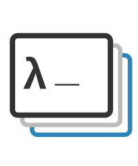

<p align="center">
  
</p>

<h1 align="center">Eigendeck</h1>

<p align="center">
  A desktop presentation tool with embedded interactive demos and LaTeX math.<br>
  Built for academics and researchers who give technical talks.
</p>

<p align="center">
  <a href="https://eigendeck.dev">Website</a> ·
  <a href="https://github.com/dgleich/eigendeck/releases">Downloads</a> ·
  <a href="docs/SPEC.md">Spec</a>
</p>

---

## Features

- **LaTeX math, matched to your type** — MathJax 4 with **10 font families**, each paired with a custom math font so equations match the body text (PT Sans, Lato, Source Sans 3, Libertinus, Computer Modern Sans/Concrete, Noto Sans, Shantell, …), plus monospace fonts for code and notebooks
- **Live IPython / Jupyter notebooks** — embed runnable notebooks (Pyodide/JupyterLite in-app, or an external Jupyter kernel); they render, scroll, and execute during your talk, and export as scrollable HTML
- **Embedded interactive demos** — drop in HTML files with D3, Canvas, or WebGL that run live; split a demo into independently positionable pieces
- **Video** — local files or YouTube / Vimeo / PeerTube embeds
- **Dual-monitor presenter** — speaker notes + next-slide preview on one screen, the deck on the projector; or a chromeless screen-share mode
- **Freeform canvas** — 1920×1080, every element positioned freely; themes, cover/reveal masks, and slide groups for builds
- **Single-file format** — `.eigendeck` SQLite file with temporal versioning and full edit history
- **Self-contained export** — interactive single-file HTML (live demos + notebooks), plus print-to-PDF (vector) and quick screenshot PDF
- **LLM-assisted editing** — `eigendeck-cli` edits decks at rest (every change is undo-safe); **File → Install LLM Tools** drops a ready-to-use kit for Claude Code and other agents
- **Native app** — built with Tauri v2; fast, lightweight, macOS / Linux / Windows

## Getting Started

Requires Node.js 20+ and Rust 1.85+. See the [development setup guide](docs/manual/development-setup.md) for full per-platform instructions.

```bash
npm install
npm run setup         # Copy MathJax bundle (one-time)
npm run tauri dev     # Development with hot-reload
npm run tauri build   # Release build
```

## Project Format

Presentations are stored as single `.eigendeck` SQLite files containing slides, elements, assets, and temporal edit history.

```bash
# CLI tools
eigendeck-cli deck.eigendeck outline          # Show slide outline
eigendeck-cli deck.eigendeck list slides      # List all slides
eigendeck-cli deck.eigendeck search "matrix"  # Search content
eigendeck-cli deck.eigendeck history          # View edit history

# Export
node tools/export-eigendeck.mjs deck.eigendeck output.html
```

## Demo Development

Demos are standalone HTML files stored as assets in the `.eigendeck` file. See [DEMO_AUTHORING.md](docs/DEMO_AUTHORING.md) for the full guide.

```bash
# Add a demo to an open presentation
# Just drag an HTML file onto the slide editor

# For LLM-assisted editing
# See docs/LLM-EDITING.md for the programmatic editing guide
```

## Manual

Editorial choices and the reasoning behind them — for people building
talks, not people reading the code. See [docs/manual/README.md](docs/manual/README.md).

## License

MIT
