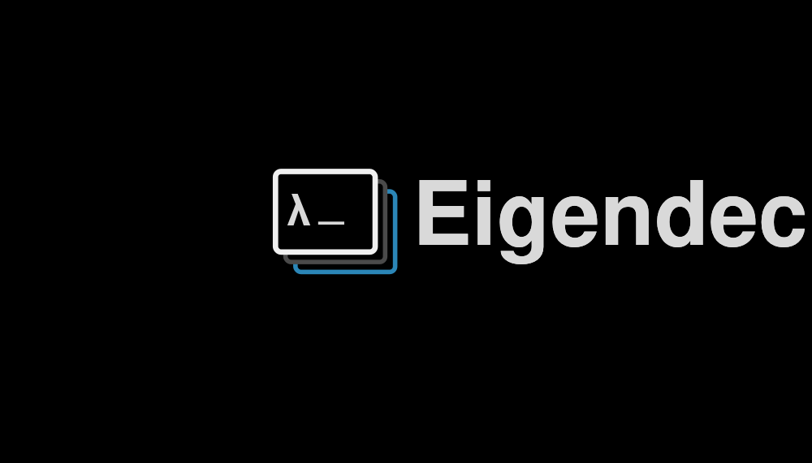
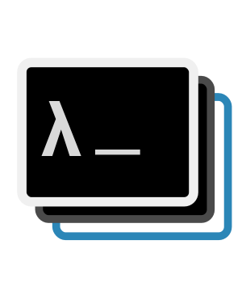
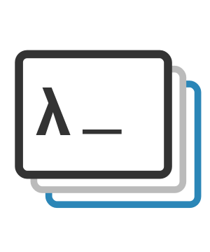
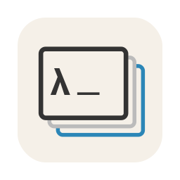
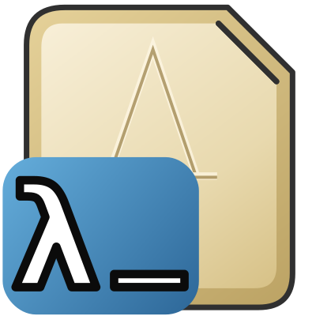
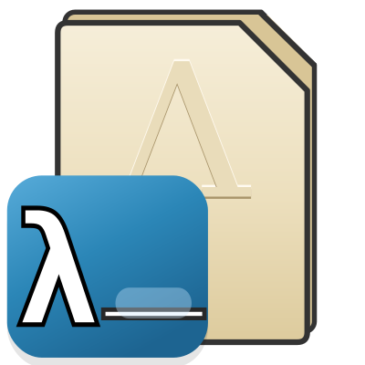

# Eigendeck icons & logos

The brand vector sources in one place, so they're findable. Every asset here is
**SVG** (the true source). Rasters (`.png`/`.icns`/`.ico`) are all *generated*
from these and should never be hand-edited.

> **Heads up on duplication.** Several of these SVGs also live at the repo root
> and under `website/` (byte-identical copies), because tooling references them
> there. The root copies are currently canonical (see "Referenced by" below).
> The copies in this folder are a curated **kit for reference**. If we want a
> single source of truth, see "Consolidation" at the bottom.

## Inventory

| File | Preview | What it is | Colorway | Canonical location · referenced by |
|------|---------|------------|----------|-------------------------------------|
| `logo.svg` |  | Full horizontal lockup: mark + "Eigendeck" wordmark. | **On-dark** (black bg baked in) | `/logo.svg` · none direct (kit) |
| `logo-icon-dark.svg` |  | The three-slide mark alone. Black screen fills, light `λ_`. For **dark** backgrounds. | On-dark | `/logo-icon.svg` · `build-manual.mjs`, `compare-icons.html` |
| `logo-icon-light.svg` |  | The three-slide mark alone. White fills, dark `λ_`, blue/gray behind. For **light** backgrounds. | On-light | `/logo-icon-light.svg` · `README.md`, `tools/generate-icons.sh` (→ app icon) |
| `app-icon-macos.svg` |  | The macOS app icon as vector: cream squircle tile + mark. Source of `src-tauri/icons/icon.icns` / `icon.png`. | Tile | `/logo-icon-macos.svg` · `compare-icons.html`, `build-showcase.mjs` |
| `proxy-icon.svg` |  | WIP proxy / small document icon: tan page + "A" watermark + blue `λ_` badge. | Document | `/gitignore/eigendeck_proxy_icon_grouped_taller.svg` (untracked) |
| `doc-icon-current.svg` |  | WIP `.eigendeck` document icon. | Document | `src-tauri/icons/document/eigendeck-doc.svg` |

## Colorway rule

The mark has two masters. Pick by background, don't recolor by hand:
- **`logo-icon-light`** on white / light surfaces (docs, the app on white, the
  document-icon page).
- **`logo-icon-dark`** on dark surfaces (dark UI, the on-dark lockup).

## How the rasters are generated

- **App icon** (`src-tauri/icons/*`): `tools/generate-icons.sh` feeds an SVG to
  `npx tauri icon`, which writes every platform slot (`.icns`, `.ico`, PNGs,
  iOS/Android). The macOS tile art is `app-icon-macos.svg`.
- **Document icon** (`src-tauri/icons/document/eigendeck-doc.icns`):
  `tools/build_doc_icns.py` renders an SVG to the ten `.iconset` slots and (on
  macOS) runs `iconutil`. See the doc-icon plan below.

## Document icon — two-master build (#130 / QuickLook fallback #131)

macOS shows one `.icns` everywhere a `.eigendeck` appears and picks the size
slot that matches the display. We author **two masters** and let the OS switch:

- **16 & 32 pt slots (px 16/32/64): the `proxy-icon` art**, drawn to still read
  at title-bar / list-view size. Shown in the title-bar proxy, Finder list &
  column views, small icon view.
- **128 pt+ slots (px 128/256/512/1024): the `logo-icon-light` mark composited
  onto Apple's `GenericDocumentIcon` template**, so the document looks native at
  large sizes (Finder icon view, Get Info, gallery). This is also the QuickLook
  thumbnail fallback for GUI-less files with no baked slide (#131).

The crossover is `SMALL_SLOTS_PT = {16, 32}` in the build script (Apple's own
convention: simplified art in 16/32 pt, detailed in 128 pt+). See
`previews/doc-icon-slots.png` for the split rendered at every native size, and
`previews/doc-icon-hero.png` for the 1024 large master.

### Build — two steps, split by machine

The **iconset is pre-rendered and committed** (`src-tauri/icons/document/
eigendeck-doc.iconset`), so the Mac step needs no Python.

**On your Mac (no venv, no brew):**
```bash
bash tools/make-doc-icns.sh     # iconutil: iconset -> eigendeck-doc.icns
```
`iconutil` is a built-in macOS tool. That's the whole Mac loop.

**Regenerate the iconset from the SVG masters** (only when the proxy art or the
mark changes) — this is the Python step, run on Linux / CI:
```bash
uv venv venv-icons && uv pip install --python venv-icons cairosvg pillow
python tools/build_doc_icon.py --preview     # rewrites the committed .iconset + previews
```
Then run `make-doc-icns.sh` on the Mac to refresh the `.icns`.

Masters: `proxy-icon.svg` (small slots) and `logo-icon-light.svg` (mark). The
Apple `GenericDocumentIcon` template is **not** committed (Apple's art); extract
it once with:
```bash
iconutil -c iconset \
  /System/Library/CoreServices/CoreTypes.bundle/Contents/Resources/GenericDocumentIcon.icns \
  -o gitignore/generic-document-icon/GenericDocumentIcon.iconset
```
(The composited page art does ship inside the generated `.icns` — that's what
Apple's document template is for.)

## ⚠ Known issue

`logo.svg` — the "Eigendeck" wordmark may overflow the `viewBox` on the right
("…deck" clipping when rendered to the declared bounds). Verify / widen the
viewBox before using it anywhere new.

## Consolidation (proposed, not yet done)

To make this folder the single source of truth, move the root `logo*.svg` here
and update the ~6 references (`README.md`, `tools/generate-icons.sh`,
`tools/build-manual.mjs`, `tools/compare-icons.html`,
`example-demos/showcase/build-showcase.mjs`, and the `website/` copies). Left as
a follow-up so it can be done deliberately without breaking the site deploy.
