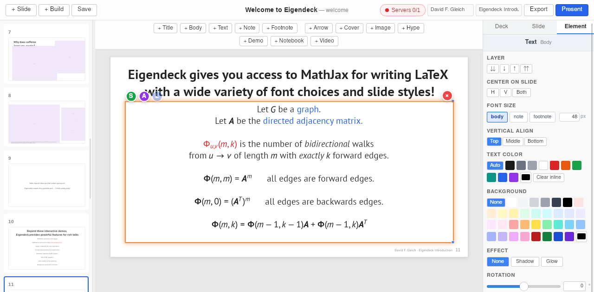
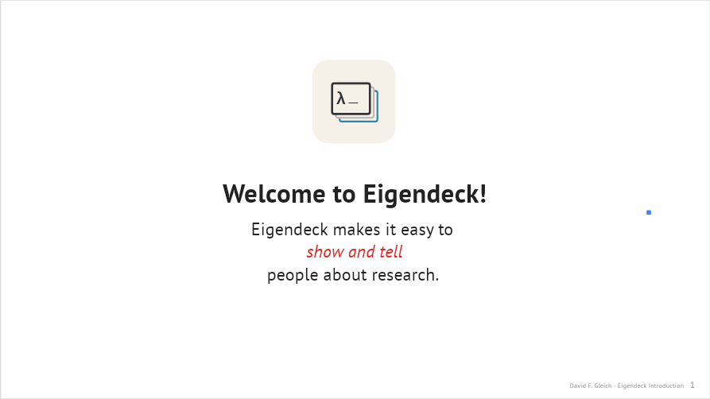
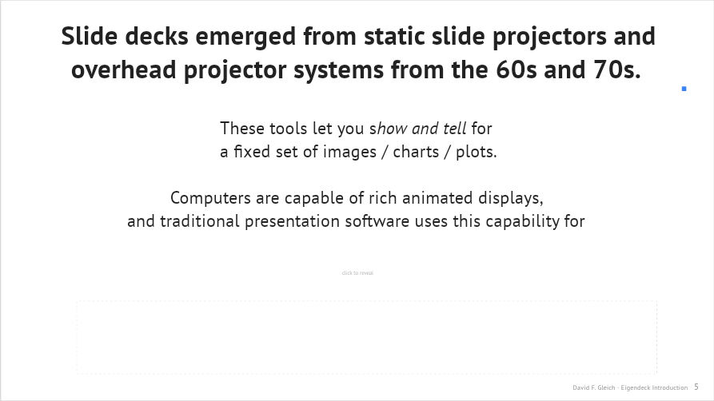
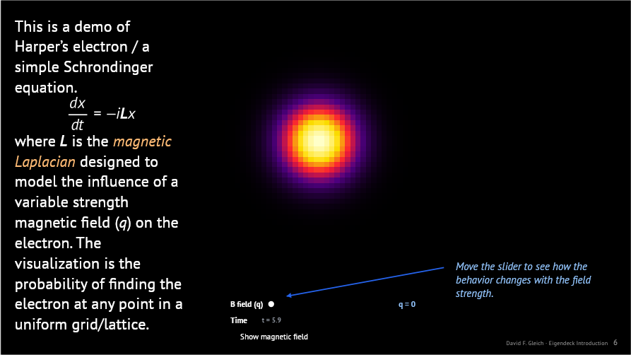
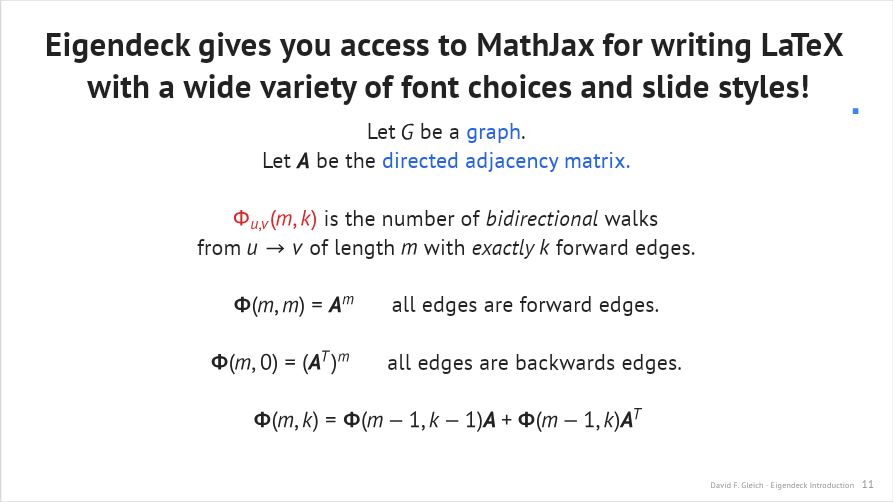
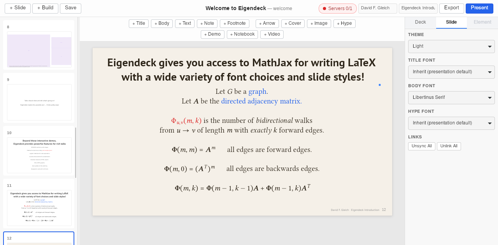
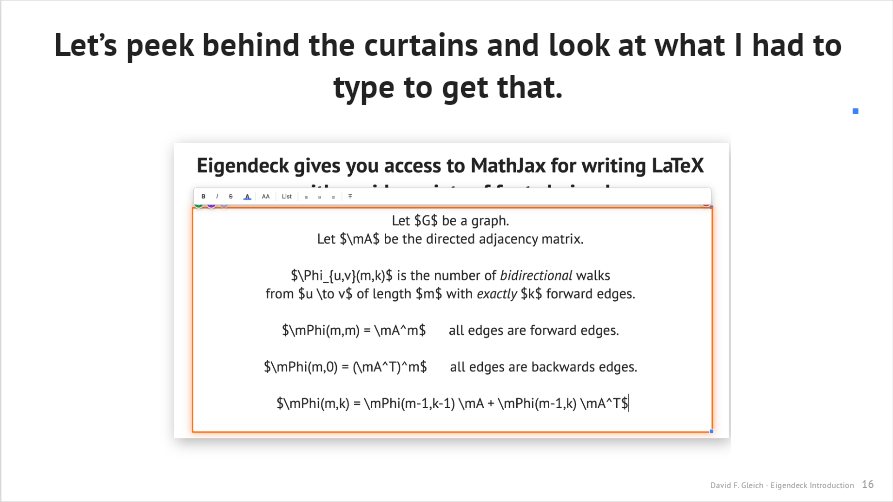
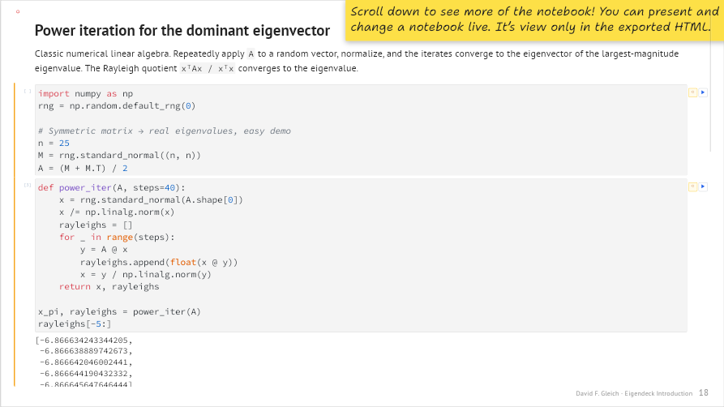

# Building a presentation

The best way to learn Eigendeck is to see how a real deck is put together. This
walkthrough follows the built-in **Welcome to Eigendeck** deck slide by slide and
explains how each one was constructed — which elements, which presets, and the
techniques (build slides, reveal masks, sync/link, per-slide fonts) behind them.

> Open the deck yourself to follow along: it ships in `examples/welcome.eigendeck`.
> Every screenshot below is that slide as it appears in the editor.

The deck has a simple arc: **introduce the idea** (show *and* tell) → **make the
argument** → **prove it with three live demos** → **tour the features** → **peek
behind the curtain** → **sign off**.

---

## The editor at a glance

Four regions, every time:

- **Slide sidebar (left)** — every slide as a thumbnail; drag to reorder,
  right-click for Duplicate / Build Slide / Delete.
- **Insert toolbar (top)** — one button per element type (Title, Body, Text,
  Note, Footnote, Arrow, Cover, Image, Hype, Demo, Notebook, Video). The same
  items live in the **Insert** menu.
- **Canvas (center)** — the 1920×1080 slide. Drag elements freely; the selected
  one shows a handle box (and small **S / A / L** badges if it's synced, animated,
  or linked across slides).
- **Inspector (right)** — three tabs: **Deck** (presentation-wide settings —
  default fonts, theme, text sizes, math macros), **Slide** (this slide's theme
  and fonts), and **Element** (the selected element's properties). It's open by
  default; toggle it with **View → Toggle Inspector**.

### Colouring text — and the math comes along

The screenshot above has the body element selected, so the inspector shows the
**Element** tab. The **Text Color** control sets the colour of the whole
element — and because inline math renders in the current text colour, *the
equations recolour with it*. That's how the red `Φ` and the blue "graph" on this
slide are done:

- **A whole element** — pick a swatch (or a custom colour) under **Text Color**.
- **Just a phrase (and its math)** — select the run while editing and use the
  format toolbar's colour; MathJax inside that run picks up the colour too. The
  **Clear inline** button removes those per-run colours and returns the element
  to one uniform colour.

The same panel carries **Background** (a panel behind the text), **Effect**
(shadow / glow for legibility over busy slides), vertical alignment, rotation,
and **Position & Size**.

---

## 1. Title and the "show / tell" opening (slides 1–3)

**Slide 1** is the simplest thing in Eigendeck: a **Title** text element, a
**Text Box** below it, and an **image** (the logo SVG). Insert each from the
**Insert** menu (or the toolbar), then drag them into place on the canvas. The
title uses the `title` preset; the sentence uses `textbox`. The logo is an SVG
dropped in via Insert → Image — Eigendeck embeds it in the deck *and* keeps
watching the file on disk so you can re-edit it (see [watched assets](assets.md)).

**Slide 2 ("… Show …")** puts a live **demo** next to a one-word title — the
"show" half. The demo is split into two *pieces* (a plot and a panel) positioned
separately. **Slide 3 ("… And Tell …")** is the "tell" half: a title plus a
**body** element containing real LaTeX (`$\vp_1,\dots,\vp_N$ …`) rendered by
MathJax. Type math inline with `$…$`; it renders in the slide's font.

> The `\vp`, `\mX` etc. are **macros** defined once for the deck (Presentation
> properties → math preamble) so you can reuse them everywhere.

## 2. The argument, with build slides and reveal masks (slides 4–8)

These slides make the case that slide decks inherited a "static projector" shape
and that computers can do more. Two techniques carry them:

- **Build slides (slide groups).** Slides 4–5 and 6–8 are *groups* — a base slide
  plus "build" copies that share numbering and reveal more each step. Duplicate a
  slide as a **Build Slide** (Slide menu, or right-click in the sidebar) and add
  the next piece; in presentation they advance as one numbered step.
- **Cover rectangles as reveal masks.** A **Cover** element is a rectangle that
  defaults to the slide background colour, so it's invisible — drop it over text
  you want to reveal later, then remove it on the next build slide. (You can also
  tint a cover any colour from the inspector.)

Slide 6 adds a **demo** to the group: the same text, now with an interactive
piece appearing alongside it. That's a build slide doing its job — the audience
sees the point made, *then* the demonstration.

## 3. Three live demos (slides 9–11)

This is the heart of the deck — three interactive demos, each made in an LLM
session and dropped onto a slide. See **[Building demos with LLMs](building-demos-with-llms.md)**
for exactly how these are produced.

**Slide 9 — Harper's electron.** A Schrödinger simulation. The demo is split into
a `probability` heatmap piece and a `controls` piece (the slider). They're
positioned independently and communicate over `BroadcastChannel`. The slide adds
a **Text Box** with the governing equation `$$\frac{dx}{dt} = -i\mL x$$`, an
**annotation** ("Move the slider…"), and an **arrow** pointing at the control.
Note the slide's **theme is black** — set per-slide in the Slide inspector — and
the demo's controls automatically adopt readable colours via the injected theme
variables.

**Slide 10 — caffeine / adenosine.** A molecule `viewer` piece plus a `panel`.
**Slide 11 — graph community structure.** Three pieces (`graph`, `controls`,
`info`) with a **footnote** explaining what you're exploring. Same pattern:
multiple pieces from one HTML file, arranged on the slide.

## 4. The pitch and the feature tour (slides 12–18)

**Slide 12** is a plain statement ("Talks should show and tell"). **Slide 13**
lists features. Then **slides 14–18** are the same math-heavy slide repeated in
**four different fonts** — Libertinus, Computer Modern Sans, Computer Modern
Concrete, and Shantell Sans — each with its own theme:

To make these, build the slide once, then **duplicate** it and change the
**Theme** and **Body font** in the **Slide** inspector tab:

Each font ships with a *matching* MathJax math font, so the equations re-render to
belong with the text — the math on the Shantell slide looks hand-drawn too. The
Shantell slide adds an **annotation** giving the author's honest take on it. See
[styles and fonts](styles-and-fonts.md).

## 5. Behind the curtain (slides 19–20)

These slides show *the editor itself* — a raster **image** screenshot of
Eigendeck — with an **annotation** and an **arrow** pointing at a math macro in
the inspector. A nice trick for a tool talk: screenshot your own UI, drop it in
as an image, and annotate it with arrows and notes.

## 6. Notebooks (slides 21–22)

**Slide 22** embeds a real **Jupyter notebook** element — scrollable, and editable
*during the talk* (it's view-only in the exported HTML). A **hype** note (the
sticky-note preset) tells the audience to scroll. Eigendeck records the notebook
in the deck without touching your source file; see [notebooks](notebooks.md).

## 7. Credits and sign-off (slides 23–24)

**Slide 23** credits the open-source software and fonts Eigendeck is built on.
**Slide 24** is a closing Text Box and the logo again — mirroring the opening.

---

## What you just learned

Putting this deck together exercises essentially the whole toolset:

| Technique | Where | Reference |
|---|---|---|
| Text presets (title / body / textbox / note / footnote / hype) | throughout | [elements](README.md#elements--features) |
| Inline LaTeX + deck math macros | slides 3, 9, 13–18 | [styles and fonts](styles-and-fonts.md) |
| Interactive demos (multi-piece) | slides 2, 6, 9–11 | [building demos with LLMs](building-demos-with-llms.md) |
| Build slides / slide groups | slides 4–8 | — |
| Cover rectangles as reveal masks | slides 4, 6 | — |
| Annotations + arrows | slides 9, 19 | [elements](README.md#elements--features) |
| Per-slide fonts + themes | slides 14–18 | [styles and fonts](styles-and-fonts.md) |
| Images (SVG + raster), watched on disk | slides 1, 19, 24 | [watched assets](assets.md) |
| Jupyter notebooks | slide 22 | [notebooks](notebooks.md) |

Then make it your own — change the text, swap the demos, pick your fonts.
